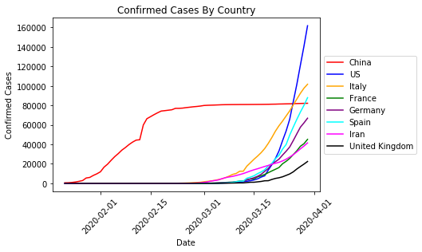
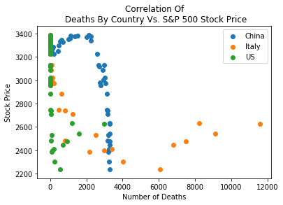

# COVID19-vs-Stocks

The purpose of this project was to analyze the effects of the Coronavirus outbreak on various stock markets around the globe. In order to do so, the group leveraged their ability to effectively make API calls using Yahoo Finance to collect real-time data on the S&P 500, Dow Jones Index, Shanghai Stock Exchange and the Italian Index. In adddition to the financial data, the group also collected and cleaned daily data on Corona Virus Cases using information from Johns Hopkins University. All of the cleaning and organization of the data was done using Python and Jupyter Notebook.

The group used the Johns Hopkins data to better understand how the virus spread within each country to make assumptions about the effects that we thought it may have had on certain stock markets. As Figure 1 confirms below, China had a significantly higher number of confirmed cases at the start of the pandemic. This is understandable considering China was where the virus started. However, we wanted to know if the rapid rate of infection in China was enough to actually make markets such as the S&P 500 react.

Figure 1: Confirmed Cases By Country

As the confirmed cases increased, so did the number of deaths. China's initial increase in death toll didn't seem to affect markets very much, but we can see that as the number of italian deaths increased the American markets began to react in a negative fashion.

Figure 2: S&P 500 Stock Price Reaction To Deaths By Country 

